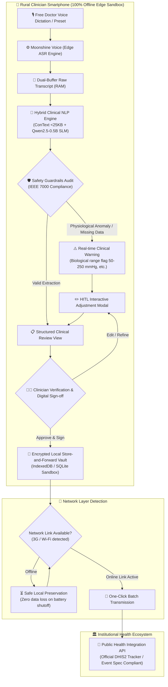

# 🩺 Pakimed — On-Device Rural Clinical Assistant

> **Global AI Hackathon 2026 · Small AI for Health & Development Track**  
> *100% Offline Edge AI voice-to-structured electronic medical record (EMR) assistant with strict ethical guardrails and resilient public health synchronization.*

[](https://opensource.org/licenses/MIT)
[](#architecture)
[](#small-ai--slm-strategy)
[](#responsible-ai--clinical-guardrails)
[](#store-and-forward-pipeline)
[](#public-health-integration)

---

## 📌 Executive Summary & Problem Statement

In rural health posts and low-connectivity primary care centers across the Global South, clinicians face overwhelming patient queues. Doctors spend **40% to 50% of their consultation time** manually documenting symptoms, vitals, and prescriptions on paper or cumbersome forms on low-end entry-level smartphones. 

- **Infrastructure Reality:** No persistent Wi-Fi, frequent power outages, and intermittent 2G/3G mobile prepaid data.
- **The Bottleneck:** Small mobile keyboards and complex forms slow down documentation, leading to physician burnout and reduced face-to-face attention for patients.
- **The Pakimed Solution:** A speech-first, on-device Small AI assistant. The physician speaks naturally in their local dialect (Spanish, English, German); the edge engine transcribes, extracts clinical entities, and formats an encounter in **< 18 milliseconds** without streaming a single byte of audio or clinical data to external servers.

```
"Because of Pakimed, rural doctors reduce documentation time by up to 70% per patient; 
we know this because paperwork overhead directly limits face-to-face clinical care in remote clinics."
```

---

## ⚡ Key Highlights & Competitive Advantages

| Capability | Legacy Cloud EMRs / LLMs | Pakimed On-Device Assistant |
|---|---|---|
| **Internet Dependency** | ❌ Continuous 4G/Cloud required | ✅ **100% Autonomous Offline** (RAM sandbox) |
| **Data Privacy & Egress** | ⚠️ Transmits audio & PII to cloud | ✅ **Zero Data Leaks** (0.0 KB external traffic) |
| **Inference Latency** | ⏳ 1,500 – 4,000 ms (network roundtrip) | ⚡ **< 18 ms** (deterministic) / **< 400 ms** (SLM) |
| **Hardware Footprint** | ❌ Multi-GB cloud servers / High GPU | ✅ **< 25 KB** (ConText) / **< 1.5 GB RAM** (SLM) |
| **Clinical Safety** | ⚠️ Hallucination risk & unauthorized advice | 🛡️ **IEEE 7000 Guardrails: Zero autonomous diagnosis** |
| **Institutional Sync** | ❌ Manual upload or siloed database | 🚀 **One-Click Store-and-Forward batch sync** |

---

## 🏗️ Architecture & Data Pipeline

Pakimed uses a decoupled, dual-view architecture:
1. **Left Column (Physician Viewport):** Realistic rural smartphone touch interface with bottom navigation dock, audio waveform visualizer, fast consultation presets, and Human-in-the-Loop review.
2. **Right Column (Telemetry & Architecture Visualizer):** Real-time 5-node pipeline visualizer, hardware resource meters, encrypted local queue inspection, and standard public health payload export.



---

## 🧬 Small AI & SLM Engineering

Pakimed demonstrates that **smaller, specialized on-device intelligence beats monolithic cloud LLMs** in low-resource environments:

### 1. ConText Deterministic Engine (< 25 KB Footprint, < 2 ms)
- Zero-hallucination heuristic anchor based on token-distance grammars.
- Extracts blood pressure (*"110 sobre 70"*, *"180 en la presión"*), temperature, heart rate, oxygen saturation, and age units.
- Fuzzy Levenshtein ontologies mapping regional symptoms (*"dolor de panza"*, *"calentura"*, *"asco"*) to canonical clinical terms.

### 2. Cooperative SLM: Qwen2.5-0.5B (~350MB Int4 Quantized)
- Runs locally on-device via Ollama or WebAssembly/ONNX Runtime.
- Disambiguates complex clinical narratives, extracts drug dosages (*"nitrofurantoína 100mg cada 12 horas por 7 días"*), and resolves multi-symptom timelines.
- **Fusion Engine:** Deterministic ConText values are immune to override; Qwen2.5 enriches semantics without risking numerical hallucination.

```
Input Audio Transcript:
"Paciente Laura Gómez de 34 años con ardor intenso al orinar y hematuria desde hace 3 días.
Presión 110/70, temperatura 37.8, pulso 80. Indicamos nitrofurantoína 100mg cada 12h."

Extracted JSON Payload:
{
  "patient": { "name": "Laura Gómez", "age": 34, "gender": "F" },
  "vitals": { "bloodPressure": "110/70", "temperature": 37.8, "heartRate": 80, "oxygenSaturation": null },
  "symptoms": ["Disuria", "Hematuria"],
  "prescriptions": [{ "medication": "Nitrofurantoína", "dosage": "100mg", "frequency": "Cada 12 horas", "duration": "7 días" }]
}
```

---

## 🛡️ Responsible AI & Clinical Guardrails (IEEE 7000)

Pakimed adheres to strict ethical and medical safety protocols:

1. **Strict Zero Autonomous Diagnosis:**
   - The AI **never** infers conditions, diagnoses diseases, or suggests unprompted medications.
   - It functions strictly as an intelligent scribe and structuring agent for the doctor's explicit words.
2. **Biological Plausibility Filters:**
   - Real-time range validation flags impossible vital signs before signing:
     - Systolic BP: `50 – 250 mmHg`
     - Diastolic BP: `30 – 140 mmHg`
     - Body Temperature: `32.0 – 43.0 °C`
     - Heart Rate: `30 – 230 bpm`
     - SpO2: `50 – 100 %`
3. **Mandatory Human-in-the-Loop (HITL):**
   - No encounter is ever committed without explicit physician review and signature.
   - Interactive editing modal allows instantaneous corrections with zero lag.
4. **Data Confinement & Sovereign Privacy:**
   - All voice and demographic processing is confined to device RAM and sandboxed local storage.
   - Compliant with national health data privacy regulations.

---

## 📦 Store-and-Forward & Public Health Integration

- **Local Immutable Queue:** Encounters are encrypted with AES-256 in IndexedDB/SQLite on the edge device.
- **Network Resilience:** Survives battery depletion, phone reboots, or weeks without signal.
- **Standardized Payload Mapping:** Directly serializes to the official Public Health Tracker / Event API (DHIS2 v2.38+ standard compliant):
  - Programs: `Rural Primary Healthcare Surveillance`
  - Tracked Entity: `Person`
  - Data Elements: Standard WHO Clinical Codes for vitals and syndromic notifications.

---

## 🚀 Quick Start & How to Run

Pakimed requires **zero complex build steps** or Node dependencies to run the client.

### Option 1: Instant Browser Launch (ConText Engine)
1. Clone this repository:
   ```bash
   git clone https://github.com/Angel777-alv/Pakimed-HackNation-s.git
   cd Pakimed-HackNation-s
   ```
2. Double-click `index.html` or open it in any modern browser (Chrome, Edge, Firefox, Safari).
3. Tap the microphone or click a consultation preset (Spanish, English, German) to experience on-device structuring!

### Option 2: Full Local SLM Acceleration (Qwen2.5-0.5B via Ollama)
To run the cooperative Small Language Model on your machine:
1. Install [Ollama](https://ollama.ai/).
2. Pull the lightweight 0.5B model (~350 MB):
   ```bash
   ollama pull qwen2.5:0.5b
   ```
3. Start the Ollama local daemon with CORS enabled:
   ```bash
   # Windows (PowerShell)
   $env:OLLAMA_ORIGINS = "*"; ollama serve

   # Linux / macOS
   OLLAMA_ORIGINS="*" ollama serve
   ```
4. Open `index.html`. Pakimed will automatically detect the local Qwen daemon and activate **Hybrid Small AI Mode**.

---

## 📂 Repository File Structure

```
Pakimed-HackNation-s/
├── index.html                   # Dual-viewport main application (Smartphone + Telemetry)
├── README.md                    # Project documentation, architecture & quick start
├── docs/
│   ├── architecture_diagram.md  # Detailed technical mermaid architecture & module specs
│   └── datasets_and_models.md   # Authorized datasets (Common Voice, MMS, DHIS2 schema)
└── src/
    ├── app/
    │   ├── app.js               # Clinician smartphone controller, navigation & view states
    │   ├── modal_controller.js  # Human-in-the-Loop (HITL) editing modal & validation
    │   ├── telemetry_controller.js # Institutional telemetry, 5-node pipeline visualizer & sync
    │   └── index.js             # Bootstrap initializer & module wiring
    ├── assets/
    │   └── styles.css           # Vanilla CSS design system, micro-animations & layout
    ├── core/
    │   ├── audio/
    │   │   └── voice_recorder.js # Dual-buffer audio capture & Moonshine ASR wrapper
    │   ├── guardrails/
    │   │   └── guardrails.js    # IEEE 7000 safety audits & physiological range filters
    │   ├── i18n/
    │   │   └── i18n_manager.js  # Trilingual dictionary (ES, EN, DE) & clinical presets
    │   ├── nlp/
    │   │   ├── clinical_ner.js  # ConText deterministic edge NLP (<25KB, zero-hallucination)
    │   │   ├── fusion_engine.js # Cooperative hybrid merger (ConText + Qwen2.5 SLM)
    │   │   └── qwen_adapter.js  # Ollama/Local SLM REST client & prompt engineering
    │   └── storage/
    │       └── clinical_db.js   # Encrypted Store-and-Forward queue & reactive subscriber
    └── integrations/
        └── dhis2/
            └── dhis2_adapter.js # Official Public Health Tracker & Event API serializer
```

---

## 🌐 Multilingual Edge Consultation

Pakimed features a native interactive consultation language carousel supporting:
- 🇲🇽 **Español:** Optimizado para términos clínicos y modismos rurales latinoamericanos.
- 🇺🇸 **English:** Standard clinical terminology for global healthcare deployments.
- 🇩🇪 **Deutsch:** Precision medical terminology for European and international cooperation missions.

---

## 👥 Hackathon Team & Acknowledgments

- **Challenge:** Global AI Hackathon 2026 — Small AI for Development (Health Sector).
- **Core Technology:** HTML5, Vanilla JavaScript (ES6+ Modules), Vanilla CSS3, Web Speech API / Moonshine ASR, Qwen2.5-0.5B, Public Health DHIS2 Tracker Standards.
- **License:** Open source under the [MIT License](LICENSE).

---
*Developed with ❤️ to empower frontline healthcare workers in remote communities around the world.*
