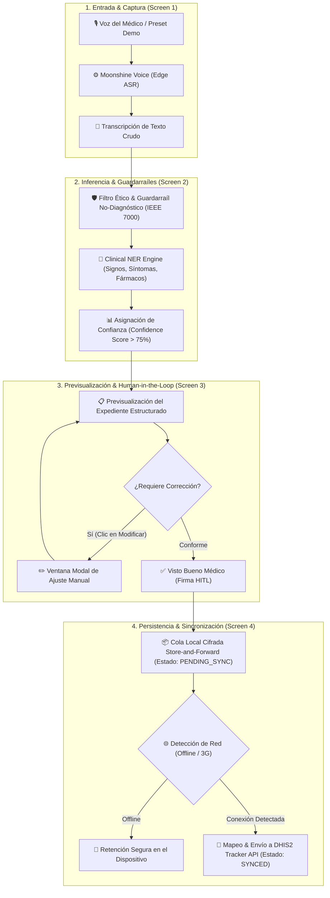

# Especificación de Requisitos de Software (SRS)
## Proyecto: Pakimed - Asistente de Registro Clínico Offline (Edge AI)
**Conforme a los estándares ISO/IEC/IEEE 29148:2018 (SRS) e IEEE 7000-2021 (Ethical AI)**  
**Reto:** Small AI for Development - Sector Salud (Global AI Hackathon 2026)  
**Versión:** 1.1.0  
**Fecha:** Octubre 2026  
**Estado:** Aprobado para Desarrollo de MVP  

---

## 1. Introducción

### 1.1 Propósito
El propósito de este documento es definir formalmente los requisitos funcionales, no funcionales, arquitectónicos y los guardarraíles éticos para el Producto Mínimo Viable (MVP) de **Pakimed**, un asistente de registro clínico por voz diseñado para operar 100% offline en dispositivos móviles de médicos en entornos rurales y de bajos recursos.

### 1.2 Alcance del Producto
Pakimed es una solución móvil basada en **Small AI / Edge AI** que elimina la carga administrativa de entrada manual de datos en clínicas rurales sobrepobladas. Permite al trabajador de la salud dictar el resumen de la consulta en su idioma local, procesa el audio on-device mediante el motor ultra-ligero **Moonshine Voice (Edge ASR)** sin enviar datos a la nube, extrae entidades clínicas estructuradas (signos vitales, síntomas, medicamentos prescritos), genera una **previsualización clínica inmediata** con una **ventana modal interactiva de ajuste y modificación manual (Human-in-the-Loop)**, y almacena los expedientes cifrados en una cola local (*Store-and-Forward*) para su posterior sincronización con la plataforma institucional **DHIS2**.

### 1.3 Definiciones, Acrónimos y Abreviaturas
* **Small AI / SLM (Small Language Model):** Modelos compactos optimizados para inferencia on-device con bajo consumo de memoria y energía.
* **Moonshine Voice:** Arquitectura de reconocimiento automático de voz (ASR) optimizada específicamente para inferencia local en procesadores y hardware móvil de gama baja.
* **Edge AI:** Ejecución de modelos de inteligencia artificial directamente en el hardware del usuario final sin depender de servidores en la nube.
* **Human-in-the-Loop (HITL):** Principio de diseño donde la decisión y aprobación final dependen estrictamente de un ser humano (el profesional médico).
* **DHIS2 (District Health Information Software 2):** Plataforma estándar de gestión de información de salud pública adoptada en más de 70 países.
* **Store-and-Forward:** Patrón arquitectónico de persistencia donde los datos se guardan de forma local y segura hasta que se detecte una conexión de red confiable.
* **NER (Named Entity Recognition):** Reconocimiento y extracción de entidades nombradas clínicas a partir de texto no estructurado.

### 1.4 Referencias y Estándares
* **ISO/IEC/IEEE 29148:2018:** Systems and software engineering — Life cycle processes — Requirements engineering.
* **IEEE 7000-2021:** Model Process for Addressing Ethical Concerns During System Design.
* **DHIS2 Web API Documentation:** Tracker and Event capture schema specifications.

---

## 2. Descripción General

### 2.1 Perspectiva del Producto
Pakimed opera como una aplicación autónoma de borde en el dispositivo móvil del médico, presentada en un marco interactivo de smartphone. No requiere servidores intermediarios propios para el procesamiento de voz o lenguaje natural, garantizando soberanía y privacidad total de los datos.

### 2.2 Funciones del Producto (Resumen del MVP)
1. **Captura y Transcripción Acústica On-Device (Moonshine Voice):** Reconocimiento de dictado clínico adaptado a hardware móvil de gama baja.
2. **Extracción Estructurada de Entidades (Clinical NER):** Clasificación automática de edad, género, signos vitales, sintomatología y fármacos indicados.
3. **Guardarraíles de Seguridad y No-Diagnóstico:** Bloqueo proactivo de cualquier inferencia diagnóstica o recomendación autónoma no dictada.
4. **Previsualización Clínica y Ventana de Modificación (HITL):** Vista resumen del expediente con ventana modal de ajuste manual de datos para aprobación médica.
5. **Persistencia Store-and-Forward & Sincronización DHIS2:** Encolado local seguro y serialización compatible con el estándar DHIS2 Tracker/Event API.
6. **Controles de Demostración Rápida (Pitch Readiness):** Botón de ejecución automatizada del pipeline para presentaciones ágiles del jurado.

### 2.3 Características de los Usuarios
* **Usuario Primario:** Médicos generales, enfermeros y trabajadores comunitarios de salud en clínicas rurales y puestos de atención primaria.
* **Contexto Operativo:** Jornadas de alta afluencia de pacientes, tiempos de consulta reducidos (3 a 7 minutos), ausencia de teclados físicos y nula o precaria conectividad a internet.

### 2.4 Restricciones de Diseño e Implementación
* **Arquitectura 100% Offline-First:** El flujo central de captura, procesamiento y aprobación debe funcionar íntegramente sin acceso a internet.
* **Hardware de Entrada:** Diseñado para teléfonos inteligentes de gama baja/media con recursos limitados (< 1.5 GB de RAM disponible para la app).
* **Privacidad Estricta:** Cero transmisión de audios sin procesar o datos clínicos a servidores comerciales o LLMs en la nube (OpenAI, Anthropic, etc.).

---

## 3. Requisitos Específicos

### 3.1 Requisitos Funcionales (RF)

#### RF-01: Captura de Audio y Dictado Clínico (Moonshine Voice Engine)
* **RF-01.1:** El sistema debe proveer una interfaz táctil enmarcada en una vista de smartphone con un botón principal de micrófono de alta visibilidad (target ≥ 48px).
* **RF-01.2:** El sistema debe procesar el audio mediante la arquitectura de **Moonshine Voice** on-device sin latencia de red.
* **RF-01.3:** El sistema debe incluir un selector de escenarios clínicos precargados para demostración instantánea durante el pitch.
* **RF-01.4:** El sistema debe incluir un botón de **Ejecución Automática de Pipeline (Demo 1-Click)** para recorrer fluidamente todo el ciclo de atención médica.

#### RF-02: Extracción Estructurada de Entidades Clínicas (Motor Híbrido Semántico/Heurístico)
* **RF-02.1:** El motor on-device debe procesar el texto transcrito y extraer los siguientes campos estructurados:
  * *Identificación y Demográficos:* Nombre del paciente (extraído de fórmulas como "señor...", "doña...", "paciente..."), Edad (número/unidad) y Género (F/M).
  * *Signos Vitales:* Presión arterial (Sistólica/Diastólica en mmHg), Temperatura corporal (°C), Frecuencia cardíaca (lpm) y Saturación de Oxígeno (SpO2 %).
  * *Síntomas y Tiempo de Evolución:* Lista normalizada de sintomatología referida con soporte de matching difuso (Levenshtein) para variantes coloquiales rurales (ej. "dolor de panza", "calentura"), junto con el tiempo de evolución detectado.
  * *Prescripciones:* Nombre de fármacos, dosis y frecuencia dictadas explícitamente por el médico.
* **RF-02.2:** El motor debe utilizar escaneo de ventanas de contexto dinámicas (N-gramas ±4 tokens) para asociar magnitudes numéricas aisladas con su correspondiente signo vital aun en presencia de ruido o muletillas conversacionales.
* **RF-02.3:** La extracción debe completarse en un tiempo no mayor a 50 milisegundos en el dispositivo móvil (< 25 KB footprint, cero dependencias de red o modelos pesados).
* **RF-02.4 (Segmentación de Discurso y Modificadores ConText / NegEx):** El pipeline procesa el diálogo clínico estructurándolo en cláusulas y segmentos discursivos (`IDENTITY`, `CHIEF_COMPLAINT`, `ALLERGY_HISTORY`, `EXAMINATION_VITALS`, `PLAN_PRESCRIPTION`), aplicando análisis de ámbito (ConText / NegEx) para:
  * Detectar antecedentes de alergias a medicamentos (ej. "alérgico a la penicilina") y derivarlas estrictamente a `patient.allergies`, excluyéndolas del listado de prescripciones activas.
  * Detectar automedicación previa del paciente (ej. "me tomé un ibuprofeno") y clasificarla en `patient.priorMedications`, evitando que contamine las recetas activas del facultativo.
  * Aislamiento por límites léxicos (`\b`) para eliminar falsos positivos de síntomas por substrings (ej. subcadenas como "tos" dentro de "estos", "contactos", "puntos").

#### RF-03: Guardarraíles de Seguridad y Ética (IEEE 7000)
* **RF-03.1 (Regla Estricta de No-Diagnóstico):** El sistema **NUNCA** debe inferir, generar o sugerir diagnósticos médicos, pronósticos o tratamientos que no hayan sido expresamente dictados por el médico.
* **RF-03.2 (Manejo de Baja Confianza):** Si el motor de extracción detecta ambigüedad o un nivel de confianza inferior al 75% en un término clínico, debe marcar el campo en blanco o resaltar la necesidad de llenado manual.
* **RF-03.3 (Human-in-the-Loop Obligatorio y Candados de Navegación):** Ningún registro podrá guardarse, consolidarse o avanzar a la confirmación (Paso 4) sin la aprobación explícita mediante el botón de visto bueno facultativo.
* **RF-03.4 (Regla de Identificación Obligatoria y Completitud Clínica para DHIS2):** El sistema exige de forma obligatoria el nombre del paciente y al menos un dato clínico válido (signo vital, síntoma o prescripción) antes de permitir la consolidación. Si falta el nombre o el registro está vacío, se bloquea la aprobación y se requiere la edición manual en el modal HITL.
* **RF-03.5 (Auditoría Cuantitativa de Rangos Fisiológicos - Cero Diagnóstico):** El sistema audita las constantes vitales en 2 niveles:
  * *Límites Biológicos Imposibles (Bloqueo):* Detecta valores absurdos (ej. PAS > 250 mmHg, Temp > 43.0 °C) e impide el guardado hasta su corrección.
  * *Observaciones Cuantitativas Objetivas:* Detecta lecturas fuera de rangos de referencia estándar (ej. PAS 180 mmHg) y emite advertencias cuantitativas descriptivas sin etiquetar diagnósticos clínicos.

#### RF-04: Previsualización Clínica y Ventana de Modificación de Formulario
* **RF-04.1 (Previsualización Estructurada):** El sistema debe generar una tarjeta de previsualización integral y estética del expediente del paciente antes de la aprobación, identificando claramente el nombre del paciente y destacando constantes no medidas.
* **RF-04.2 (Ventana Modal de Modificación y Ajuste):** El profesional de la salud debe poder desplegar una ventana modal interactiva con validación reactiva en tiempo real para editar, corregir o complementar cualquier valor demográfico, signo vital, síntoma o fármaco.
* **RF-04.3 (Verificación Ética Visible):** La previsualización debe mostrar un distintivo visible de cumplimiento de guardarraíles ("Cero diagnóstico generado automáticamente").

#### RF-05: Almacenamiento Seguro Store-and-Forward
* **RF-05.1:** Al aprobar la consulta, el registro debe almacenarse en la base de datos local reactiva del dispositivo (`ClinicalDB` / LocalStorage / IndexedDB) en estado `PENDING_SYNC`.
* **RF-05.2:** El sistema debe listar el historial de consultas locales diferenciando registros sincronizados vs. pendientes con actualización en tiempo real vía patrón observador.
* **RF-05.3:** El sistema debe permitir al usuario alternar entre simulación Offline y detección de red 3G/Wi-Fi.

#### RF-06: Serialización e Integración con DHIS2
* **RF-06.1 (Sanitización de Datos):** El sistema debe convertir el registro clínico aprobado en un payload JSON conforme a la especificación estándar de DHIS2 Event / Tracker API, empaquetando únicamente constantes vitales medidas y válidas (omitiendo valores nulos para proteger la integridad institucional).
* **RF-06.2:** Al detectar conectividad, el sistema debe permitir la sincronización en lotes de los registros pendientes.
* **RF-06.3 (Serialización de Alergias Medicamentosas en DHIS2):** Si el registro contiene alergias confirmadas por el facultativo, el adaptador de DHIS2 debe serializarlas dentro del data element institucional correspondiente (`DE_ALERGIAS_MEDICAMENTOSAS`), garantizando su disponibilidad para la seguridad del paciente en el sistema de salud pública.

---

## 4. Requisitos No Funcionales (RNF)

#### RNF-01: Rendimiento y Eficiencia (Small AI)
* **RNF-01.1:** El consumo de memoria RAM de la aplicación en ejecución no debe exceder 150 MB en navegador/dispositivo.
* **RNF-01.2:** La aplicación debe iniciar y estar lista para dictado en menos de 1.0 segundo.

#### RNF-02: Usabilidad y Experiencia de Usuario (UX)
* **RNF-02.1:** Interfaz presentada en marco de smartphone táctil optimizado para móviles y panel de telemetría institucional de apoyo.
* **RNF-02.2:** Contraste visual elevado y paleta médica profesional (Dark Slate / Medical Cyan / Emerald) aptos para condiciones de luz variables en campo.

#### RNF-03: Seguridad y Privacidad
* **RNF-03.1:** Principio de privacidad por diseño: Ningún fragmento de audio o dato sensible de salud del paciente debe transmitirse a servidores de terceros.
* **RNF-03.2:** Los registros almacenados en el dispositivo deben mantenerse aislados en el sandbox seguro del navegador o almacenamiento local.

---

## 5. Matriz de Trazabilidad de Requisitos (MVP)

| ID Requisito | Descripción | Componente en Código | Estándar / Criterio Hackatón |
| :--- | :--- | :--- | :--- |
| **RF-01** | Captura de audio (Dual-Buffer Streaming ASR) | `src/core/audio/voice_recorder.js` | Edge AI / Inclusión local |
| **RF-02** | Extracción Híbrida Semántica, ConText/NegEx y Alergias | `src/core/nlp/clinical_ner.js` | Small AI on-device (< 25 KB) |
| **RF-03** | Guardarraíles éticos, No-diagnóstico y Rangos Fisiológicos | `src/core/guardrails/guardrails.js` | IEEE 7000 / IA Responsable (Pass/Fail) |
| **RF-04** | Previsualización y Ventana de Modificación | `src/app/app.js` & `index.html` | Supervisión médica obligatoria (HITL) |
| **RF-05** | Base de Datos Reactiva & Store-and-Forward | `src/core/storage/clinical_db.js` | Resiliencia Offline |
| **RF-06** | Mapeo y serialización DHIS2 (Event API + Alergias) | `src/integrations/dhis2/dhis2_adapter.js` | Estándar global de salud pública |

---

## 6. Criterios de Aceptación del MVP para el Hackatón
1. **Flujo Demostrable Completo (User Journey de 4 Pantallas en Teléfono Simulado):**
   * Pantalla 1: Captura con Moonshine Voice / Selección de caso de prueba + Botón Demo 1-Click.
   * Pantalla 2: Inferencia Edge AI offline sin tráfico de red.
   * Pantalla 3: Previsualización de ficha clínica y ventana modal de ajuste con guardarraíles éticos y visto bueno médico.
   * Pantalla 4: Vista de cola Store-and-Forward y visualización del payload JSON oficial listo para DHIS2.
2. **Cumplimiento Ético Estricto:** Evidencia explícita en código y UI de que la herramienta actúa únicamente como asistente de documentación y no como prescriptor o diagnosticador autónomo.
N oficial listo para DHIS2.
2. **Cumplimiento Ético Estricto:** Evidencia explícita en código y UI de que la herramienta actúa únicamente como asistente de documentación y no como prescriptor o diagnosticador autónomo.
