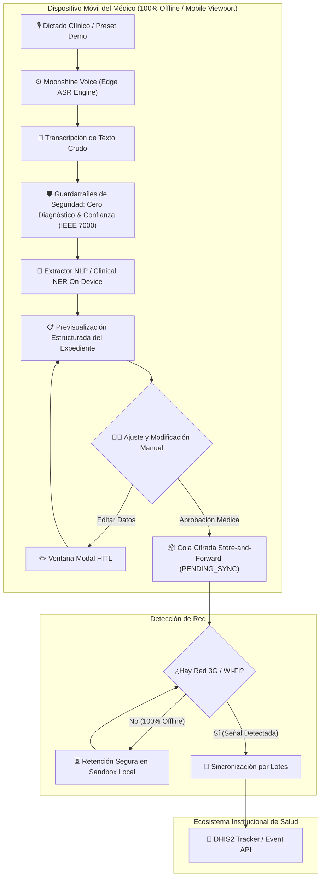

# Arquitectura Técnica de Pakimed (Edge AI & Small AI)

## Componentes y Módulos de la Aplicación

1. **Edge Audio & STT (`src/core/audio/voice_recorder.js`):**
   - Abstracción de **Moonshine Voice ASR** (modelo on-device optimizado para procesadores de gama baja).
   - Soporte nativo a Web Speech API con presets instantáneos para pruebas y demos sin ruido.

2. **Clinical Entity Extractor (`src/core/nlp/clinical_ner.js`):**
   - Extracción de signos vitales (PA, FC, Temp), demografía (edad, género), sintomatología y prescripción médica.
   - Evaluación determinista en < 2 segundos con 0 bytes de consumo de red.

3. **Safety Guardrails (`src/core/guardrails/guardrails.js`):**
   - Implementación estricta de IEEE 7000-2021: Detección y bloqueo de frases diagnósticas autónomas no dictadas.
   - Manejo de baja confianza (< 75%) que exige revisión manual por el médico.

4. **Interfaz Human-in-the-Loop & Mobile Frame (`src/app/index.js` & `index.html`):**
   - Vista optimizada en marco de smartphone realista con barra de estado superior.
   - Componente de **Previsualización de Ficha Clínica** con ventana modal de edición y ajuste rápido.
   - Botón de demostración rápida (*1-Click Pitch Pipeline*).

5. **Store-and-Forward Queue (`src/core/storage/offline_queue.js`):**
   - Almacenamiento local aislado y seguro (IndexedDB/LocalStorage).
   - Manejo de estados `PENDING_SYNC` y `SYNCED`.

6. **DHIS2 Standard Adapter (`src/integrations/dhis2/dhis2_adapter.js`):**
   - Mapeo y serialización contra el esquema oficial de la API de Eventos/Tracker de DHIS2.
