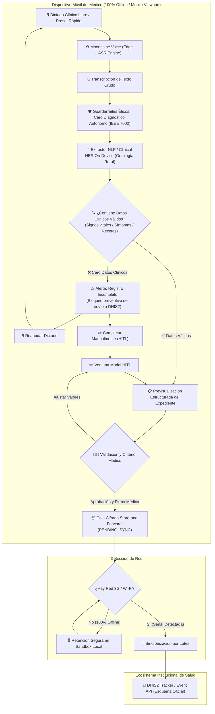

# Arquitectura Técnica de Pakimed (Edge AI & Small AI)

## Componentes y Módulos de la Aplicación

1. **Edge Audio & STT (`src/core/audio/voice_recorder.js`):**
   - Abstracción de **Moonshine Voice ASR** (modelo on-device ultraligero para procesadores de gama baja sin nube).
   - Captura de audio y transcripción libre en tiempo real mediante Web Speech API nativa, con cronómetro y estados de oscilación acústica.
   - Cero sobreescrituras forzadas de texto: permite dictado de voz libre y redacción directa.

2. **Clinical Entity Extractor (`src/core/nlp/clinical_ner.js`):**
   - Ontología clínica rural en memoria local (< 30 KB en RAM): extracción determinista de signos vitales (PA, FC, Temp, SpO2), demografía (edad, género), ~80 síntomas frecuentes y medicamentos esenciales OMS con posología.
   - Segmentación de *token spans* con cálculo de índice de certeza/confianza por entidad.
   - Preservación íntegra de términos atípicos en notas de respaldo para no descartar información crítica.

3. **Safety Guardrails & Calidad de Datos (`src/core/guardrails/guardrails.js`):**
   - **Regla Estricta de No-Diagnóstico (IEEE 7000):** Prohibición activa de emitir inferencias diagnósticas no dictadas por el facultativo.
   - **Regla de Completitud Clínica:** Detección de dictados vacíos o conversaciones casuales sin datos clínicos; bloquea el envío de expedientes corruptos a DHIS2 e invita a reanudar el dictado o completar manualmente.
   - **Manejo de Baja Confianza:** Marcado de advertencia para términos ambiguos o con confianza < 75%.

4. **Interfaz Human-in-the-Loop & Mobile Frame (`src/app/app.js` & `index.html`):**
   - Desacoplado: orquesta los módulos a través de `window.Pakimed.*` sin dependencias de empaquetadores ni problemas de CORS en `file:///`.
   - Previsualización clínica estructurada con ventana modal para ajustes manuales rápidos.
   - Evidencia visual en tiempo real de los pasos de estructuración on-device.

5. **Store-and-Forward Queue (`src/core/storage/offline_queue.js`):**
   - Persistencia local segura y resiliente (LocalStorage / IndexedDB).
   - Gestión estricta de estados de ciclo de vida: `PENDING_SYNC` (en sandbox local) y `SYNCED` (consolidado en DHIS2).

6. **DHIS2 Standard Adapter (`src/integrations/dhis2/dhis2_adapter.js`):**
   - Serialización de datos clínicos estructurados conforme a la especificación oficial de DHIS2 Tracker / Event API.
