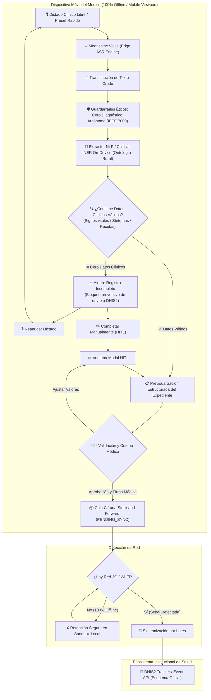

# Arquitectura Técnica de Pakimed (Edge AI & Small AI)

## Componentes y Módulos de la Aplicación

1. **Edge Audio & STT (`src/core/audio/voice_recorder.js`):**
   - Abstracción de **Moonshine Voice ASR** (modelo on-device ultraligero para procesadores de gama baja sin nube).
   - Gestión de **Buffer Dual Estricto** (`accumulatedFinal` + `currentInterim`): elimina el 'efecto eco' y duplicaciones recursivas de transcripción en tiempo real.
   - Sincronización transparente con edición manual de notas clínicas y cronómetro reactivo.

2. **Clinical Entity Extractor (`src/core/nlp/clinical_ner.js`):**
   - **Motor Semántico Híbrido On-Device (< 25 KB de footprint, 0 ms de latencia):**
     - Normalización y limpieza de ruido conversacional (muletillas, titubeos).
     - Escaneo contextual por ventana de N-gramas (±4 tokens) para capturar presiones y temperaturas aisladas o coloquiales (*"180 en la presión"*, *"temperatura normal de 36°"*).
     - Mapeo ontológico difuso (*Fuzzy String Similarity Levenshtein / Jaro-Winkler*) para asociar modismos populares (*"dolor de panza"*, *"calentura"*, *"asco / ganas de devolver"*) a terminología médica canónica.
     - Extracción de tiempos de evolución (*"desde hace 3 días"*) y farmacología esencial OMS.

3. **Safety Guardrails & Calidad de Datos (`src/core/guardrails/guardrails.js`):**
   - **Regla Estricta de No-Diagnóstico (IEEE 7000):** Prohibición activa de emitir inferencias diagnósticas no dictadas por el facultativo.
   - **Validación de Rangos Fisiológicos Plausibles:** Detección de constantes biológicamente imposibles o anómalas (PA 50-250, Temp 32-43°C, FC 30-230 lpm, SpO2 50-100%, Edad 0-120 años) con alertas de seguridad previas a la firma.
   - **Regla de Completitud Clínica:** Detección de dictados vacíos o conversaciones casuales sin datos clínicos; bloquea el envío de expedientes corruptos a DHIS2 e invita a reanudar el dictado o completar manualmente.

4. **Interfaz Móvil del Médico (`src/app/app.js`):**
   - Controlador enfocado exclusivamente en la experiencia del facultativo: navegación táctil, captura de voz y estado inicial limpio (sin plantillas forzadas).
   - Comunica cambios y expedientes aprobados a la base de datos local y al controlador de telemetría.

5. **Modal HITL & Validación Reactiva (`src/app/modal_controller.js`):**
   - Componente desacoplado para la edición supervisada (Human-in-the-Loop).
   - Validación reactiva en tiempo real sobre constantes vitales (bloqueo interactivo y señalización visual de valores fuera de rangos biológicos plausibles).

6. **Base de Datos Local & Telemetría (`src/core/storage/clinical_db.js`):**
   - Motor de persistencia local reactivo con patrón observador (`subscribe`).
   - Gestión estricta de estados de ciclo de vida: `PENDING_SYNC` (en sandbox local) y `SYNCED` (consolidado en DHIS2).
   - Generación de hashes de seguridad local y cálculo dinámico de estadísticas de telemetría institucional.

7. **DHIS2 Standard Adapter (`src/integrations/dhis2/dhis2_adapter.js`):**
   - Serialización de datos clínicos estructurados conforme a la especificación oficial de DHIS2 Tracker / Event API.

8. **Consola Institucional de Telemetría (`src/app/telemetry_controller.js`):**
   - Orquesta la columna derecha: visor de payloads DHIS2, métricas de confinamiento de tráfico, alternancia de conectividad móvil y sincronización por lotes.
   - Totalmente desacoplada de la interfaz del móvil; reacciona a eventos de `ClinicalDB`.

